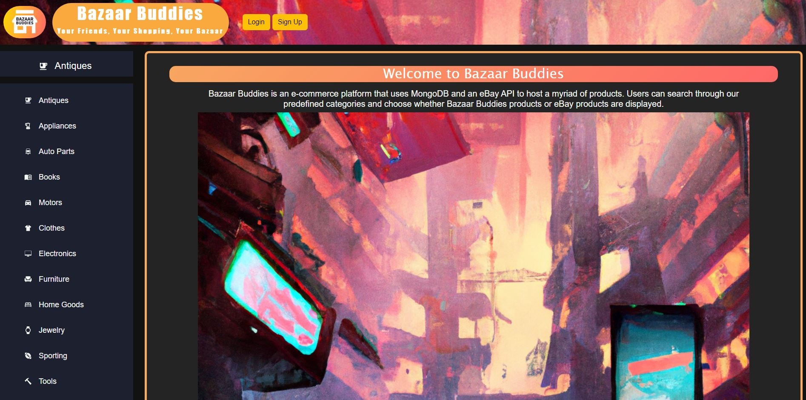
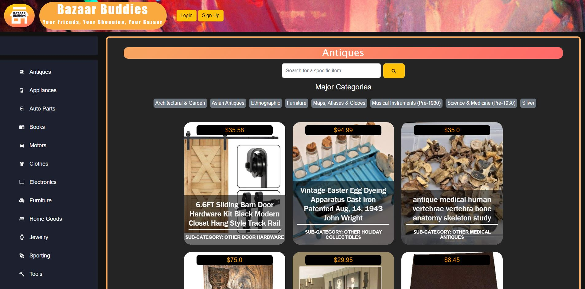
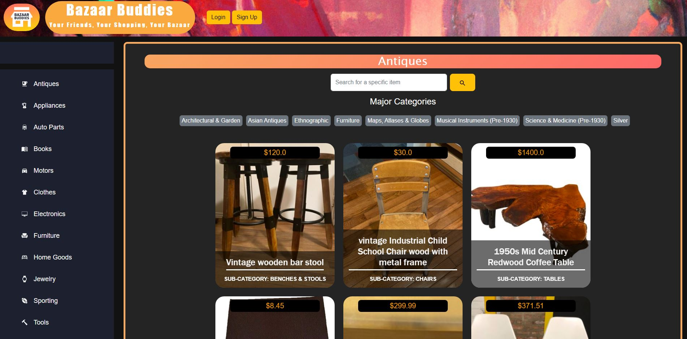
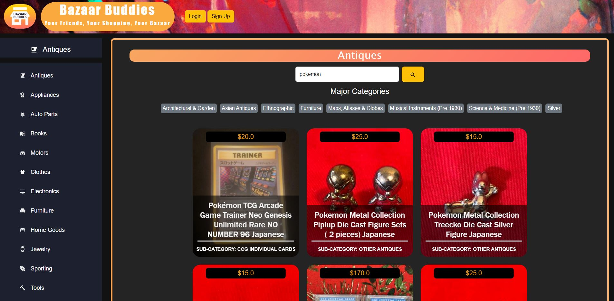
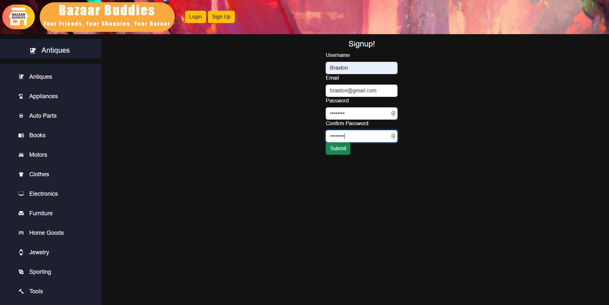
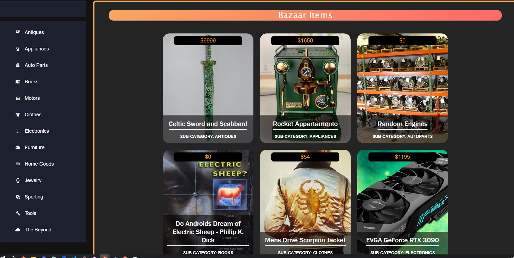
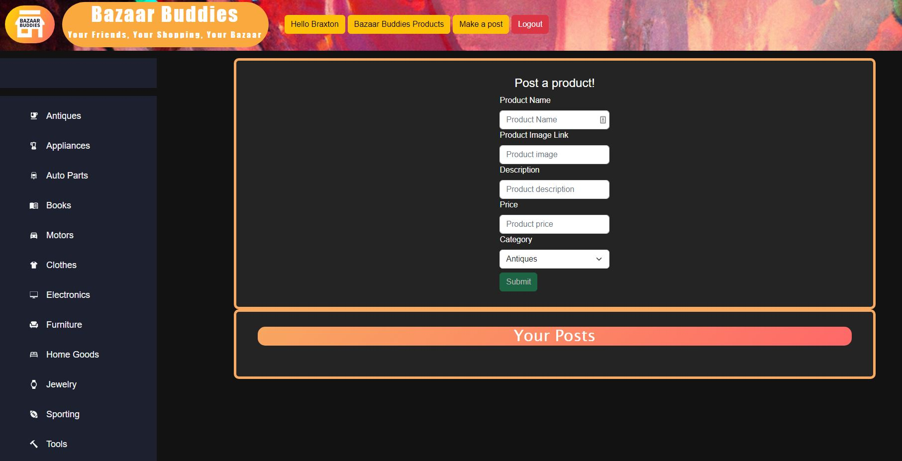
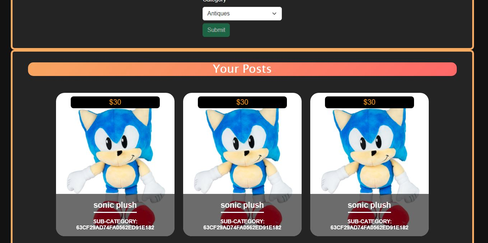

# Bazaar-Buddies

## Description
We are mimicking the famous site from the early 2000s, Craigslist. For this project, the team is using MERN to format, create and structure the whole application from scratch. The focus of this team is to demonstrate each member's ability and technical skills in creating a diverse and interactive application.

On this website, the user can search and post any products listed on the site. To search for an item,  the user can use the "search" bar on top of the page or the sidebar to find a specific item within a category. To post on the site, the user can click on "post" to be taken to the posting page and follow the prompt to post any item. 

## Table of Contents

- [Installation](#installation)
- [Usage](#usage)
- [Tests](#tests)
- [Contributing](#contributing)
- [Questions](#questions)
- [License](#license)
- [Credits](#credits)

## Installation

- To install the project fork the repository to your own repo.
- Make sure to connect a `MongoDB` and `Apollo Server` sandbox to test properly.
- Install the `Moesif Origin & CORS Changer` chrome extension to view the ebay products.
- run `npm i` to install the dependencies.
- run `npm run seed` to seed the database
- run `npm run build` to create the site build
- run `npm run develop`

## Usage

This application will be push on heroku, which could be access here. [Bazaar Buddies](https://bazaar-buddies.herokuapp.com/).

See Bazaar-Buddies hosted data a user must create an account, upon which a new button in the header will appear to view Bazaar products. 

If user forgets to logout or the page crashes make sure to clear localStorage / cache so that the Auth key is deleted.

## Screenshots

- Screenshot 1: Homepage

- Screenshot 2: Caterogy

 Screenshot 3: Specific Page for Sub-Caterogy

 Screenshot 4: Searching For Specific Product

 Screenshot 5: Sign Up

 Screenshot 6: Database Specific Item

 Screenshot 7: Creating Post

 Screenshot 8: Finalize Post

## Tests

There are currently no testing being done for this application.

## Contributing

The team is not accepting any contribution at this moment. Feel free to fork and work independently of the project!

## Questions

Feel free to send over an email with any questions you may have about the project!

- Braxton Minkey: braxtoncoding@gmail.com  
- Sky Texier: skyhamilton@gmail.com  
- Jongwon Lee:  
- Minh Nguyen: minhcao1115@gmail.com 

## License
Licensed under [MIT](https://opensource.org/licenses/MIT).

## Credits

Github of Project Creators:

[Braxton Minkey](https://github.com/BrackyM) 
[Sky Texier](https://github.com/skytexier) 
[Jongwon Lee](https://github.com/JongwonLee123) 
[Minh Nguyen](hhtps://github.com/) 